# 🚲 Velib Trend - Real-Time & Predictive Vélib' Availability

> **"Don't just find a bike. Know where the bikes will be."**

**Velib Trend** is an intelligent journey planner for the Paris Vélib' bike-sharing system. Unlike standard apps that only show *current* availability, Velib Trend uses **Machine Learning (LSTM)** to predict bike availability 1-3 hours in the future, helping users plan reliable trips.

---

## 🎥 Project Demo

[**▶️ Watch the Presentation Video**](presentation.mp4)

*(Click the link above to play the video)*

---

## ✨ Key Features

- **🔮 AI-Powered Predictions**: accurate forecasts for bike/dock availability up to 3 hours ahead (MAE: ~2.9 bikes).
- **🗺️ Smart Journey Planner**: Finds the optimal route (Walk + Bike + Walk) and checks if bikes will *actually* be there when you arrive.
- **⚡ Real-Time Dashboard**: Interactive map with live status, color-coded by availability (Green = Safe, Red = Empty).
- **🛡️ Robust Architecture**: Serverless backend (AWS Lambda) with multi-layer caching and rate-limit protection.

---

## 🏗️ System Architecture

The project follows a **Hybrid Cloud** approach to minimize costs while maximizing scalability.

```mermaid
flowchart TB
    subgraph Client["Client Side"]
        User(("👤 User Browser"))
    end

    subgraph Frontend_Cloud["Streamlit Cloud"]
        Streamlit["🖥️ Streamlit App<br/>(Frontend UI)"]
    end

    subgraph AWS_Cloud["AWS Cloud (eu-west-3)"]
        style AWS_Cloud fill:#f9f9f9,stroke:#ff9900,stroke-width:2px
        
        subgraph Compute["Serverless Compute"]
            LambdaAPI["⚡ AWS Lambda<br/>(FastAPI Backend)"]
            LambdaCron["⏱️ AWS Lambda<br/>(Snapshot Collector)"]
        end
        
        subgraph ML["Machine Learning"]
            SageMaker["🧠 SageMaker<br/>(Serverless Inference)"]
        end
        
        subgraph Storage["Data Storage"]
            S3_Bronze[("🗄️ S3 Bucket<br/>(Raw Snapshots)")]
            S3_Models[("📦 S3 Bucket<br/>(Model Artifacts)")]
        end
    end

    %% Data Flow
    User <-->|HTTPS| Streamlit
    Streamlit <-->|REST API| LambdaAPI
    
    %% Backend Logic
    LambdaAPI -->|Read History| S3_Bronze
    LambdaAPI -->|Invoke| SageMaker
    SageMaker -.->|Load Model| S3_Models
    
    %% Data Collection
    LambdaCron -->|Hourly Write| S3_Bronze
    
    %% Styling
    classDef aws fill:#FF9900,stroke:#232F3E,stroke-width:2px,color:white;
    classDef streamlit fill:#FF4B4B,stroke:#333,stroke-width:2px,color:white;
    classDef storage fill:#3F8624,stroke:#333,stroke-width:2px,color:white;
    
    class LambdaAPI,LambdaCron,SageMaker aws;
    class Streamlit streamlit;
    class S3_Bronze,S3_Models storage;
```

---

## 🧠 Model Architecture (LSTM)

The core intelligence is a **Long Short-Term Memory (LSTM)** neural network trained on historical station data.

---

## 🛠️ Tech Stack

| Category | Technologies |
|----------|--------------|
| **Frontend** | Streamlit, Plotly, PyDeck |
| **Backend** | FastAPI, Python 3.12, Mangum |
| **Cloud (AWS)** | Lambda, S3, SageMaker, ECR |
| **Machine Learning** | PyTorch, LSTM, Optuna (Hyperparameter Tuning) |
| **DevOps** | Docker, GitHub Actions (CI/CD) |
| **Data** | OpenStreetMap (Nominatim/Photon), Vélib' Open Data |

---

## 🚀 Try it Live

The application is fully deployed and accessible online. No installation required!

👉 **[Launch Velib Trend](https://velibtrend.streamlit.app)**

---

## 📚 Documentation

For detailed information about the **Model Architecture**, **AWS Infrastructure**, and **Performance Benchmarks**, please refer to the technical documentation:

👉 **[View Full Documentation](documentation/README.md)**

---

## 👨‍💻 Author

**Joshua Dumont**  

- 💼 [LinkedIn Profile](https://www.linkedin.com/in/dumont-joshua/)
- 📧 [dumonthoshua@gmail.com](mailto:dumonthoshua@gmail.com)
