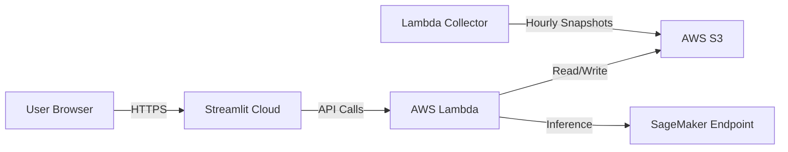

# Architecture & Deployment Guide

## 🏗️ Hybrid Cloud Architecture

To optimize costs while maintaining scalability, the project uses a **Hybrid Cloud Architecture**:

- **Frontend**: Hosted on **Streamlit Community Cloud** (Free tier).
- **Backend**: Hosted on **AWS Lambda** (Serverless, pay-per-use).
- **Inference**: Hosted on **Amazon SageMaker Serverless Inference**.
- **Storage**: **Amazon S3** for historical data and model artifacts.

### Architecture Diagram



---

## 🚀 Backend Deployment (AWS Lambda)

The backend is a FastAPI application wrapped with `Mangum` to run on AWS Lambda.

### 1. Docker Image
The backend is containerized using `docker/backend/Dockerfile.lambda`.
- **Base Image**: `public.ecr.aws/lambda/python:3.12`
- **Dependencies**: `fastapi`, `mangum`, `boto3`, `requests`
- **Handler**: `src.app.handler`

### 2. AWS Lambda Configuration
- **Function Name**: `velib-api-backend`
- **Memory**: 512 MB (sufficient for API logic)
- **Timeout**: 30 seconds
- **Function URL**: Enabled (HTTPS endpoint)
- **CORS**: Restricted to `https://velibtrend.streamlit.app`

### 3. Deployment Steps
1.  **Build & Push Docker Image**:
    ```bash
    aws ecr get-login-password --region eu-west-3 | docker login --username AWS --password-stdin <account_id>.dkr.ecr.eu-west-3.amazonaws.com
    docker build -t velib-backend -f docker/backend/Dockerfile.lambda .
    docker tag velib-backend:latest <account_id>.dkr.ecr.eu-west-3.amazonaws.com/velib-backend:latest
    docker push <account_id>.dkr.ecr.eu-west-3.amazonaws.com/velib-backend:latest
    ```
2.  **Update Lambda**:
    ```bash
    aws lambda update-function-code --function-name velib-api-backend --image-uri <account_id>.dkr.ecr.eu-west-3.amazonaws.com/velib-backend:latest
    ```

---

## 🧠 Inference Deployment (Amazon SageMaker)

The LSTM model is deployed using **SageMaker Serverless Inference** to minimize costs (pay only when predicting).

### 1. Model Packaging
- **Artifacts**: `best_model.pth`, `config.json`, `scaler.pkl`, `station_mappings.json`
- **Code**: `inference/code/inference.py` (implements `model_fn`, `input_fn`, `predict_fn`, `output_fn`)
- **Format**: `model.tar.gz` uploaded to S3.

### 2. SageMaker Configuration
- **Endpoint Name**: `velib-lstm-v3-endpoint`
- **Type**: Serverless
- **Memory**: 3072 MB (3 GB) - Minimum for PyTorch
- **Max Concurrency**: 5 (Auto-scaling)
- **Cost**: ~$1/month (vs $47/month for always-on)

---

## 🎨 Frontend Deployment (Streamlit Cloud)

The frontend is hosted on Streamlit Community Cloud, connected directly to the GitHub repository.

### Configuration
1.  **Repository**: `Velib_Trend` (branch `main`)
2.  **Main File**: `src/streamlit_app.py`
3.  **Secrets**:
    ```toml
    VELIB_API_BASE = "https://uxhsjwdfkqgjmdxbmt5oidv2ca0cgejs.lambda-url.eu-west-3.on.aws"
    ```

### Deployment Process
1.  Push changes to GitHub `main` branch.
2.  Streamlit Cloud automatically detects changes and redeploys.
