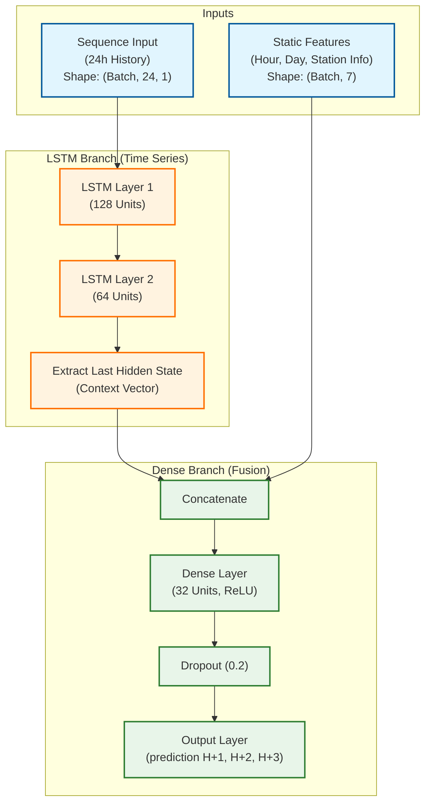

# Model Development & Optimization

## 📊 Model Performance History

### Model v3 (Production) ✅
- **Deployed**: Oct 21, 2025
- **Architecture**: LSTM (128→64) + Dense(32)
- **Data**: 20 days (Oct 1-21)
- **Performance (T+1h)**: MAE **2.95** bikes, R² **0.815**
- **Status**: **Live on SageMaker**

### Model Architecture Diagram

### Model v4 (Best Candidate) ⚠️
- **Trained**: Oct 28, 2025
- **Data**: 27 days (Oct 1-28)
- **Performance (T+1h)**: MAE **2.79** bikes, R² **0.859** (+5.4% improvement)
- **Decision**: Not deployed. Improvement too marginal to justify redeployment. Waiting for 2-3 months of data.

---

## 🛠️ Feature Engineering

### 1. Production Features (Model v3)
The currently deployed model uses **7 static features**:
- **Temporal**: `hour` (0-23), `day_of_week` (0-6), `is_weekend` (0/1)
- **Station**: `capacity`, `station_id` (numeric ID), `latitude`, `longitude`

### 2. Experimental Features (Model v4+)
For the next iteration (v4), 5 new features were added to capture seasonal and behavioral trends:
- **Temporal**: `month`, `season`, `part_of_day` (0-3)
- **Behavioral**: `is_rush_hour` (7-9h, 17-19h), `is_lunch_time` (12-14h)

---

## ⚡ Optimization Strategy

### Hyperparameter Optimization (Optuna)
**Optuna** is used to find the best hyperparameters.
- **Objective**: Minimize Validation Loss (MSE)
- **Search Space**:
  - `lstm_hidden_1`: 64-256
  - `lstm_hidden_2`: 32-128
  - `dense_hidden`: 16-64
  - `dropout_rate`: 0.1-0.5
  - `learning_rate`: 1e-4 to 1e-2

### GPU Acceleration
Training is optimized for **RTX 4060 Laptop GPU**:
1.  **Mixed Precision (AMP)**: Uses FP16 for computations, FP32 for stability. 2-3x speedup.
2.  **TF32**: Enabled for matrix multiplications on Ampere architecture.
3.  **Data Loading**: `num_workers=4` and `pin_memory=True` in PyTorch DataLoader.

---

## 🔮 Future Improvements

To reduce MAE below 2.0 bikes, the plan is to add:
1.  **Weather Data**: Rain, temperature, wind (High impact expected).
2.  **Calendar Events**: Public holidays, school vacations, strikes.
3.  **Long-term Data**: Training on 3-6 months of data to capture seasonal trends.

