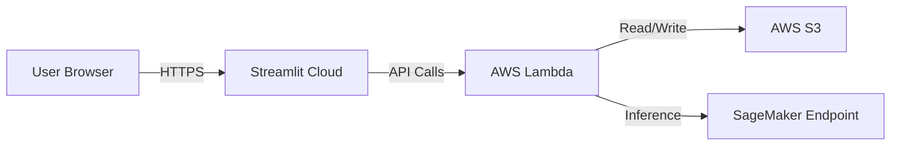

# Hybrid Deployment Architecture

## Overview
To optimize costs while maintaining scalability, the project uses a **Hybrid Cloud Architecture**:
- **Frontend**: Hosted on **Streamlit Community Cloud** (Free tier).
- **Backend**: Hosted on **AWS Lambda** (Serverless, pay-per-use).

## Architecture Diagram

## Components

### 1. Frontend (Streamlit)
- **Hosting**: Streamlit Community Cloud (connected to GitHub).
- **Configuration**:
  - `VELIB_API_BASE`: Environment variable pointing to the Lambda Function URL.
- **Docker (Local)**: `docker/frontend/Dockerfile` (Lightweight, no ML libs).

### 2. Backend (FastAPI)
- **Hosting**: AWS Lambda (Container Image).
- **Adapter**: `Mangum` is used to adapt FastAPI for AWS Lambda.
- **Docker**: `docker/backend/Dockerfile` (Includes FastAPI, Mangum, Boto3).
- **Scaling**: Scales to zero when not in use (Cost effective).

## Local Development
We use `docker-compose` to replicate this architecture locally:
- **Frontend**: `http://localhost:8501`
- **Backend**: `http://localhost:8000`

## Deployment Steps

### Backend (AWS Lambda)
1. Build and push the backend Docker image to AWS ECR.
2. Create/Update Lambda function using the ECR image.
3. Enable Function URL (Auth: NONE for public API, or IAM if proxied).

### Frontend (Streamlit Cloud)
1. Push code to GitHub.
2. Connect Streamlit Cloud to the repository.
3. Set `VELIB_API_BASE` in Streamlit Cloud secrets/settings.
